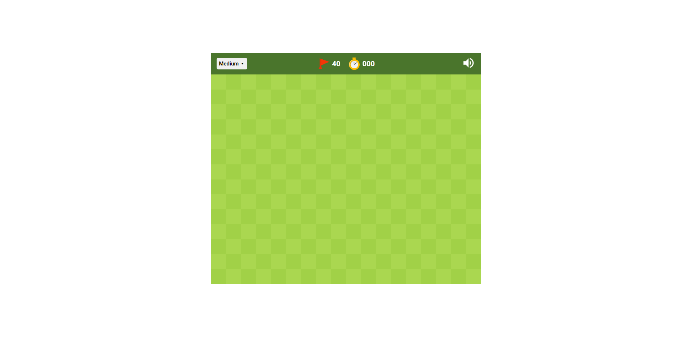

<h1 align="center">Minesweeper-React</hi>
<h5 align="center">A small webapp to play Minesweeper</h5>

<div align="center">
  <a href="https://reactjs.org/"></a>
  <a href="https://vitejs.dev/"></a>
  <a href="https://www.typescriptlang.org/"></a>
</div>

<hr>

## Installation

1. Install all required dependencies using

```shell
npm install
```

or

```shell
pnpm add
```

or whatever package manager you're using

## Usage

1. Navigate to the main directory, and run

```shell
npm run dev
```

or

```shell
pnpm run dev
```

2. Navigate to the URL Vite provides in the console

## The App



### Features

- All normal Minesweeper functions
- 3 difficulties to choose from
- Clean design (shamelessly taken from <a href="https://www.google.com/fbx?fbx=minesweeper">Google Minesweeper</a>)
- All implemented in React, with clear and concise code
- Works (?) with almost any screen size
